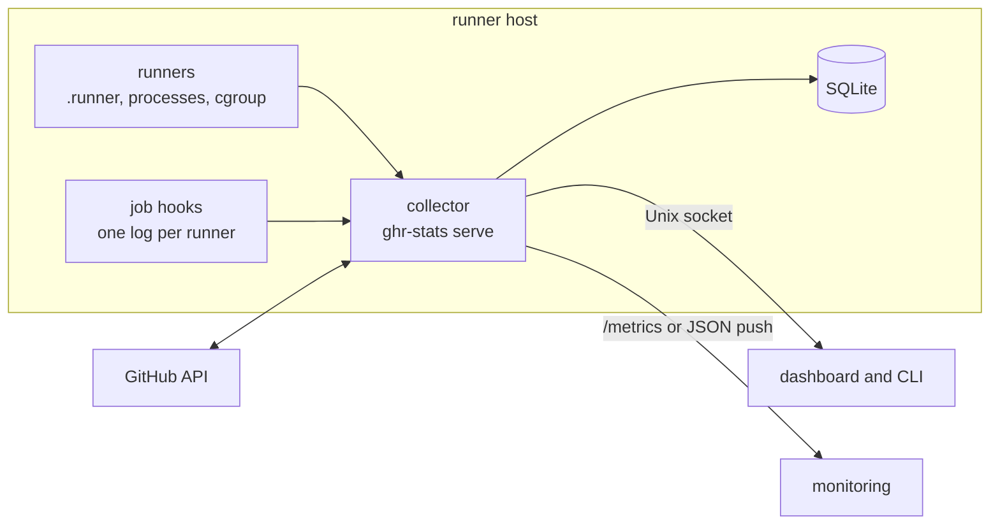

# ghr-stats

[](https://crates.io/crates/fso-ghr-stats)
[](https://releases.rs)
[](LICENSE)

**A terminal dashboard and Prometheus exporter for self-hosted GitHub Actions
runners.** It shows each runner as this host sees it and as GitHub sees it, side
by side, so a runner that looks healthy but gets no work stands out.

```text
 Summary  │  Jobs  │  Trends  │  Config  │  Quit                                         PERSISTENT
┌ ghr-stats v0.4.0 ────────────────────────────────────────────────────────────────────────────────┐
│ 8 runners    ● 1 busy    ○ 7 idle    × 0 offline                                                 │
│ load 0.42    mem 9.7 GiB/31.3 GiB (31%)    /tmp 2.1 GiB    free 612.4 GiB                        │
│ github: 8 known · 8 online · 1 busy                                                              │
└──────────────────────────────────────────────────────────────────────────────────────────────────┘
┌ runners (8) ─────────────────────────────────────────────────────────────────────────────────────┐
│ Runner          Org                   Local     For     Hook   GH       CPU      Mem(ws)    Up   │
│▌runner-01       example-org           ● busy    4m2s    ✓      ● busy   38.4%    1.2 GiB    2d4h │
│ runner-02       example-org           ○ idle    1h3m    ✓      ○ idle   0.0%     172.0 MiB  2d4h │
│ ...                                                                                              │
└──────────────────────────────────────────────────────────────────────────────────────────────────┘
```



- **Works on any host running the standard runner**: everything comes from each
  runner's own `.runner` file, processes and cgroup. Runners installed as systemd
  services are found automatically; others need one `runner_roots` entry.
- **Two truths per runner**: local liveness and GitHub's view. Up locally but
  offline to GitHub is **divergent**, flagged in the dashboard, `status` and
  metrics.
- **github.com, GitHub Enterprise Server and GHE.com**: organization and
  repository runners are reconciled with GitHub; enterprise runners are sampled
  locally.
- **Scriptable**: `status --json` and five more verbs with a strict exit-code
  contract, where `2` always means "could not see", never "no".
- **Careful with privilege**: fine-grained read-only PATs, never logged; runner
  files never trusted; every command run elevated on a runner is one audited
  enum.
- **Synchronous and small**: no async runtime; one SQLite writer; a static musl
  build for distribution.

## Modes

| | Ephemeral | Persistent |
| --- | --- | --- |
| Needs | nothing | the collector service |
| Live runners, host, detail | ✓ | ✓ |
| Trends | since the dashboard started | history, 30 days by default |
| GitHub's view per runner | — | ✓ (with a PAT) |
| Jobs and results | — | ✓ (hooks; results need Actions: Read) |
| Prometheus pull, JSON push | — | ✓ (opt-in) |

The dashboard picks the mode itself: it connects to a running collector, or
samples the host on its own.

## Install

```bash
cargo install fso-ghr-stats --locked   # installs the `ghr-stats` binary
```

Linux only (procfs, cgroup v2, systemd). For a static musl binary instead,
`scripts/release.sh` builds `target/x86_64-unknown-linux-musl/release/ghr-stats`
(needs a musl C compiler).

## Quick start

```bash
ghr-stats                                               # Ephemeral dashboard, no setup
sudo ~/.cargo/bin/ghr-stats config                      # find runners, add PATs, install hooks
sudo ~/.cargo/bin/ghr-stats systemd install --system    # the collector: Persistent mode
sudo ghr-stats doctor                                   # check everything
ghr-stats status --json                                 # fleet state; exit code = verdict
```

`systemd install --system` copies the binary to `/usr/local/bin`, so plain
`sudo ghr-stats` works from then on. To upgrade, `cargo install` again and re-run
that line.

## Documentation

Start at the [docs index](docs/README.md): [Configuration](docs/configuration.md),
[CLI & operations](docs/cli.md), [For agents](docs/agents.md),
[Metrics](docs/metrics.md), [Runner hooks](docs/hooks.md),
[Privileged operations](docs/privileged.md), [Design & internals](docs/design.md).

## License

MIT, see [LICENSE](LICENSE).
