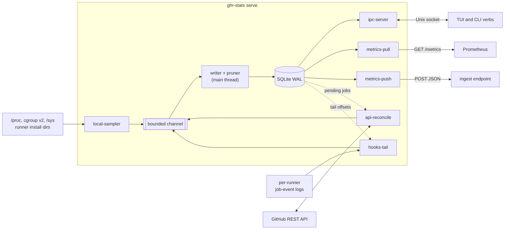
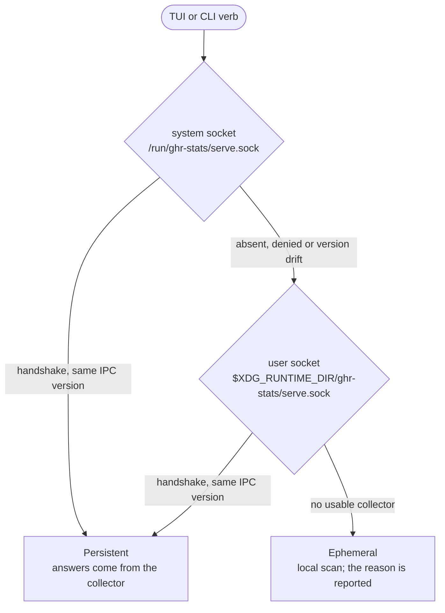
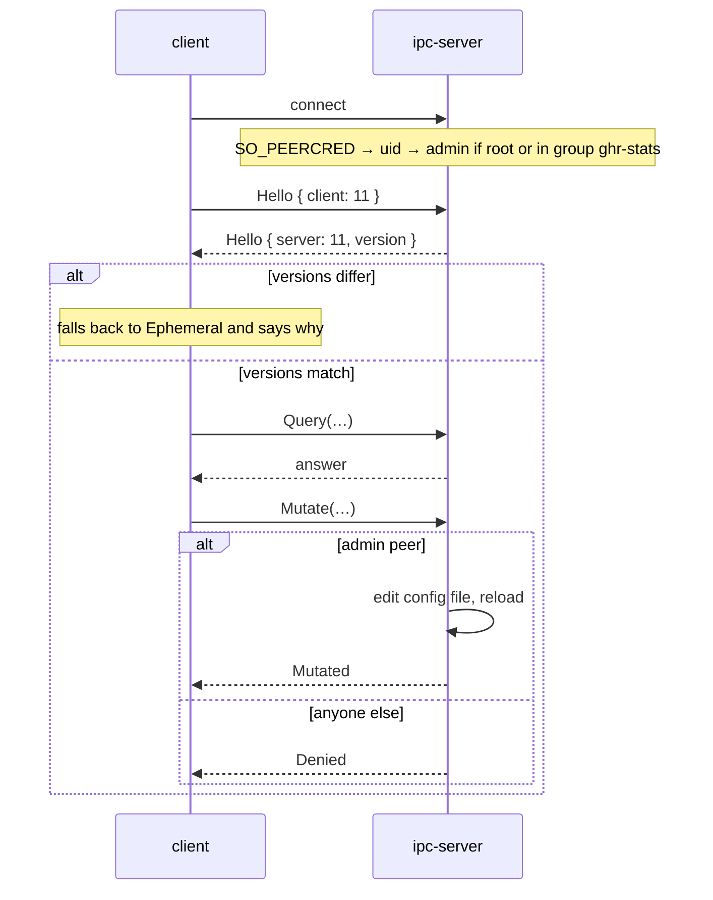

# Design & internals

[← Docs](README.md)

ghr-stats is one synchronous binary. As `serve` it is the collector; as anything
else it is a client that either talks to the collector or, with none running,
samples the host itself.

## The collector

Producers never touch the database for writing: they send samples over one
bounded channel, and the main thread is the only writer. Readers open their own
`query_only` WAL connections, so a slow scrape or TUI query never blocks a write.

| Thread | Runs every | Reads | Produces |
| --- | --- | --- | --- |
| `local-sampler` | `intervals.local_secs` (5 s) | `.runner` files, `/proc`, cgroup v2, `/sys`, `statvfs`; `_work` size every 12th tick | runner and host samples |
| `api-reconcile` | `intervals.api_secs` (60 s, floor 10 s) | GitHub runner listings per scope; job results for completed jobs from the last day | GitHub's view per runner, job conclusions |
| `hooks-tail` | 2 s | each runner's job-event log, from its stored offset | job starts and completions |
| writer (main) | per sample; prunes hourly in 200 ms slices | the channel | SQLite rows; deletes samples past `retention_days` |
| `ipc-server` | per connection (8 slots, the last 2 for admins) | SQLite | query answers; config edits from admin peers |
| `metrics-pull` | per scrape | SQLite | Prometheus text on `metrics.pull.addr` |
| `metrics-push` | `metrics.push.interval_secs` (30 s, floor 5 s) | SQLite | JSON POST to `metrics.push.endpoint` |

No async runtime: each thread polls a shared stop flag between short sleeps, so
SIGTERM stops the collector without waiting out an interval.

## Identity

A runner's identity on this host is its **install directory**. GitHub's `agentId`
is unique only inside one registration scope, so GitHub's view joins back on
`(org, agentId)`. Everything else about a runner comes from its own `.runner`
file and processes, never from unit names.

The scope comes from `.runner`'s `gitHubUrl`:

| `gitHubUrl` | Scope | GitHub listing |
| --- | --- | --- |
| `https://github.com/<org>` | organization | `/orgs/<org>/actions/runners` |
| `https://github.com/<owner>/<repo>` | repository | `/repos/<owner>/<repo>/actions/runners` |
| `https://github.com/enterprises/<slug>` | enterprise | not reconciled |
| `https://<ghes-host>/…` | same three, on GitHub Enterprise Server | `https://<ghes-host>/api/v3/…` |
| `https://<tenant>.ghe.com/…` | same three, on GHE.com | `https://api.<tenant>.ghe.com/…` |

## Clients and modes

The dashboard and the machine-facing verbs never open the database; only `serve`
and `db prune` do. The socket is what lets a non-root dashboard read a root
collector: anyone may connect to it, while SQLite's WAL mode needs write access
to the database's directory.

### IPC

Length-prefixed JSON frames (1 MiB cap) over the Unix socket. The peer's uid
comes from the kernel (`SO_PEERCRED`), never from the wire.

| Request | Answer | Who |
| --- | --- | --- |
| `Hello` | IPC version and build version | anyone |
| `Query::FleetStatus` | the snapshot behind `status` and `/metrics` | anyone |
| `Query::Timeline` | edges over a window, optionally samples | anyone |
| `Query::RunnerHistory`, `HostSeries`, `BusySeries` | chart series | anyone |
| `Query::RecentJobs`, `LatestJob` | job rows | anyone |
| `Query::LatestApiRunners`, `RunnerStates` | GitHub's view, persisted liveness edges | anyone |
| `Query::Retention` | oldest retained sample | anyone |
| `Query::ConfiguredTokenOrgs` | which orgs have a PAT (never the token) | anyone |
| `Mutate(Mutation::AddOrgToken)`, `Mutate(Mutation::RemoveOrgToken)` | write or remove a PAT | root or `ghr-stats` group |
| `Mutate(Mutation::SetMetricsPull)` | toggle the pull endpoint | root or `ghr-stats` group |

Mutation handlers take an `Admin` value, which only `Peer::admin()` builds, so a
code path that skips the check does not compile.

## Where things live

| | System scope (root) | User scope |
| --- | --- | --- |
| Config | `--config`, `$GHR_STATS_CONFIG`, else `/etc/ghr-stats/config.toml` | the same |
| Database | `/var/lib/ghr-stats/ghr-stats.db` | `$XDG_DATA_HOME/ghr-stats/ghr-stats.db` |
| Hook scripts | `/var/lib/ghr-stats/hooks/` | the same: hook install needs root |
| Socket | `/run/ghr-stats/serve.sock` | `$XDG_RUNTIME_DIR/ghr-stats/serve.sock` |
| Binary | `/usr/local/bin/ghr-stats` | `~/.local/bin/ghr-stats` |
| Unit | `/etc/systemd/system/ghr-stats.service` | `$XDG_CONFIG_HOME/systemd/user/ghr-stats.service` |

Scope follows the effective uid unless `systemd install --system` / `--user`
forces it. Job-event logs are per runner, in the runner's install dir; see
[Runner hooks](hooks.md).

## Story map

| Module | Story |
| --- | --- |
| `shared::collectors` | What each runner is doing, seen from this host: processes, cgroup, host load |
| `shared::runner_files` | Runner-owned files are read without trusting them |
| `shared::github` | Where a runner is registered (`RunnerScope`), which token may ask (`TokenKey`, `FineGrainedPat`), and GitHub's answer |
| `shared::hooks` | Recording jobs through the runner's own hook variables, and reading them back |
| `shared::privileged` | Every command elevated per call, as one closed enum; `Root` proves a root process |
| `shared::config` | Settings, their defaults, and where they came from (`Provenance`) |
| `shared::ipc` | The wire between collector and clients |
| `service::serve` | Sample, reconcile, tail, write, prune |
| `service::store` | The SQLite schema and its one writer and many readers |
| `service::ipc_server` | Answer anyone; change config only for an `Admin` |
| `service::metrics` | Prometheus pull and JSON push of the same snapshot |
| `ops::status`, `explain`, `timeline`, `doctor`, `wait`, `tail` | The machine-facing verbs ([For agents](agents.md)) |
| `ops::configure`, `systemd`, `uninstall` | Operator verbs that change the host |
| `tui` | The dashboard: `app` holds state, `view` draws it, `input` routes keys and clicks |

## Platform

Linux only: procfs, cgroup v2, `/sys`, `AF_UNIX` and systemd. The build fails on
other targets rather than shipping something that cannot sample.

## See also

- [Privileged operations](privileged.md): the elevated half of this picture
- [Metrics](metrics.md): what the snapshot exports
- [Configuration](configuration.md): every setting named above
