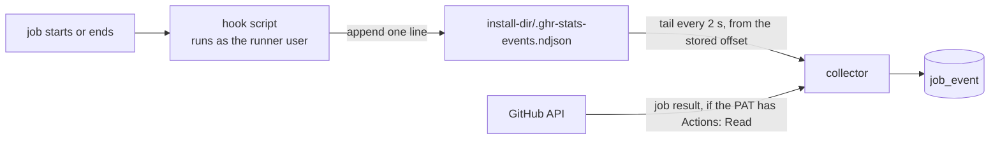
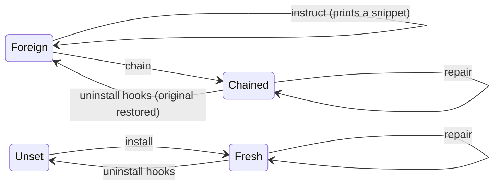

# Runner hooks

[← Docs](README.md)

The Jobs view and each runner's in-flight job come from the runner's own job
hooks, `ACTIONS_RUNNER_HOOK_JOB_STARTED` and `ACTIONS_RUNNER_HOOK_JOB_COMPLETED`.
Each hook appends one JSON line to a log in that runner's install dir; the
collector tails every log. Job **timing** comes from the hooks; the job's
**result** comes later from the GitHub API.



## Install

`ghr-stats config` or the TUI's `[h]` sets up hooks per runner. A runner allows
one script per hook variable, and many operators already use them, so nothing is
overwritten:



| State in the runner's `.env` | What install does | What `uninstall hooks` does |
| --- | --- | --- |
| no hook variables | points both at our scripts (**fresh**) | removes our three variables |
| another script in both variables | **chain**: a wrapper per variable runs the original first and keeps its exit code, then ours; or **instruct**: prints the lines to add yourself | restores the originals, deletes the wrappers |
| another script in one variable | chains that one and points the other at ours, or instructs | reports it for a human, changes nothing |
| both point at ours or our wrappers | sets the event-log variable if it is missing or wrong | reverts it when both are our scripts or both our wrappers; a mix is reported for a human |
| one of ours, the other unset | treated as another script | reports it for a human, changes nothing |
| one of ours, the other foreign | treated as another script | leaves it alone as foreign |

Install writes three lines into the runner's `.env`:

```bash
ACTIONS_RUNNER_HOOK_JOB_STARTED=/var/lib/ghr-stats/hooks/job-started.sh
ACTIONS_RUNNER_HOOK_JOB_COMPLETED=/var/lib/ghr-stats/hooks/job-completed.sh
GHR_STATS_EVENT_LOG=/srv/actions-runner/runner-01/.ghr-stats-events.ndjson
```

Chain wrappers live beside our scripts, named after the install dir
(`chain-srv-actions-runner-runner-01-started.sh`). Editing `.env` needs root; the
file keeps its owner and mode. A runner picks up a changed `.env` on restart, and
ghr-stats restarts it only if it is idle when checked just before the restart. A
busy runner is left running and reported.

## The event log

One file per runner, in its install dir, owned by the runner user, so the hook
can always append and no shared file or group is needed. Scripts do nothing if
`GHR_STATS_EVENT_LOG` is unset and always exit 0, because a failing
`JOB_STARTED` hook fails the job.

```json
{"phase":"started","ts":1785044382,"repo":"example-org/web","run_id":123456789,"run_attempt":1,"job":"build","runner":"runner-01"}
```

| Field | From | Used for |
| --- | --- | --- |
| `phase` | `started` or `completed` | the edge; any other value drops the line |
| `ts` | `date +%s` on the runner | start and end times |
| `repo` | `GITHUB_REPOSITORY` | must be `<owner>/<name>` under the runner's own scope owner, else the line is dropped |
| `run_id`, `run_attempt` | `GITHUB_RUN_ID`, `GITHUB_RUN_ATTEMPT` | which run attempt to ask GitHub about |
| `job` | `GITHUB_JOB` | the job's id in the workflow file |
| `runner` | `RUNNER_NAME` | ignored; the runner is the one whose log this is |

The log is written by the runner user, so the collector treats it as untrusted:
it refuses symlinks, FIFOs, hard links and files owned by anyone but the runner
or root, reads at most 1 MiB of each log per tick, and skips any line that is not valid UTF-8
or JSON. See [Privileged operations](privileged.md#runner-owned-files).

## Job results

The hook knows a job ended, not whether it passed. The collector asks GitHub for
jobs completed in the last day, oldest first, at most 30 run attempts per cycle,
using `/runs/{id}/attempts/{n}/jobs`, so a re-run never lends its result to an
earlier attempt. This needs **Repository → Actions: Read** on the PAT; without it,
jobs keep their timing and a neutral result.

A pending job is matched against the jobs of that attempt that ran **on the same
runner**:

1. a job whose name equals `GITHUB_JOB`;
2. else the single matrix leg named `<job> (…)`;
3. else the only job that runner ran in that attempt.

Anything else stays unresolved rather than guessed. The known gap: a job with a
custom `name:` that differs from its id, on a runner that ran more than one job
of the same attempt.

## See also

- [Configuration](configuration.md#github-tokens): PAT permissions per runner scope
- [CLI & operations](cli.md#uninstall): `uninstall hooks`
- [`packaging/hooks/`](../packaging/hooks/): the two scripts
