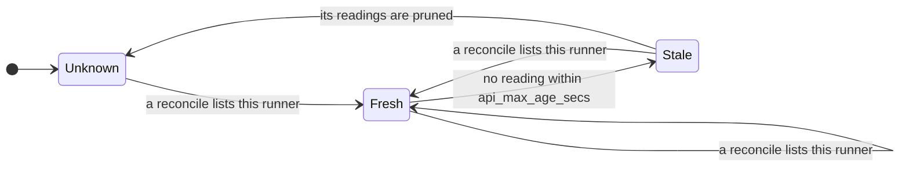

# Metrics

[← Docs](README.md)

The collector exports one snapshot two ways, both off by default and enabled in
`[metrics]` ([Configuration](configuration.md#settings)):

- **Pull**: `GET /metrics` in Prometheus text format on `metrics.pull.addr`
  (default `127.0.0.1:9477`). The endpoint has no authentication, so a
  non-loopback address exposes runner and org names to that network. A failed
  read answers HTTP 500, never an empty page.
- **Push**: every `interval_secs` (default 30), a JSON array POSTed to
  `metrics.push.endpoint`, with `auth` sent as the `Authorization` header. When
  push starts, the log shows the endpoint without credentials or query string,
  and warns once if `auth` would travel over plain HTTP to a non-loopback host.

`status --json` is built from the same snapshot, so its verdict and the series
agree.

## Two truths per runner

- **Local liveness** (`ghr_runner_up`, `ghr_runner_busy`): the runner's
  processes on this host. "Is the listener running?"
- **GitHub's view** (`ghr_runner_github_online`): the API reconcile. "Will GitHub
  send this runner work?"

A runner that is up locally but offline to GitHub is **divergent**
(`ghr_runner_divergent`).

GitHub's view of each runner is its newest reading, served only while fresh:



| View | `github_online` | `divergent` | `github_sample_age_seconds` |
| --- | --- | --- | --- |
| Fresh | `0` or `1` | `0` or `1` | present |
| Stale | absent | absent, or `0` when locally offline | present |
| Unknown: no reading on record (no PAT, never listed, pruned) | absent | absent, or `0` when locally offline | absent |

A locally offline runner is never divergent: every other series already shows
it.

Absent means "we cannot say", never "offline". Alert on the absence separately,
through the reconcile-health series below.

## Families

Runner series carry `agent_id`, `name` and `org`; `org` is the organization,
repository owner or enterprise the runner is registered to, without the host.

| Family | Type | Labels | Meaning | Absent when |
| --- | --- | --- | --- | --- |
| `ghr_build_info` | gauge | `version` | always `1` | never |
| `ghr_fleet_runners` | gauge | | runners discovered | never |
| `ghr_fleet_by_state` | gauge | `state` = `busy`, `idle`, `offline`, `divergent` | runners per state | never |
| `ghr_last_sample_timestamp_seconds` | gauge | | last local sample | nothing sampled yet |
| `ghr_host_load1` | gauge | | 1-minute load average | no host sample yet |
| `ghr_host_mem_bytes` | gauge | `kind` = `used`, `total` | host memory | no host sample yet |
| `ghr_jobs_total` | counter | | job rows recorded by the hooks | never |
| `ghr_jobs_running` | gauge | | jobs started with no completion recorded | never |
| `ghr_runner_up` | gauge | runner | `1` unless locally offline | never |
| `ghr_runner_busy` | gauge | runner | `1` while running a job | never |
| `ghr_runner_cpu_percent` | gauge | runner | cgroup CPU over the last tick | first tick, or no cgroup |
| `ghr_runner_mem_bytes` | gauge | runner | cgroup working set (anon + shmem; `memory.current` if `memory.stat` is unreadable) | no cgroup |
| `ghr_runner_mem_current_bytes` | gauge | runner | cgroup `memory.current`, page cache included | no cgroup |
| `ghr_runner_state_seconds` | gauge | runner, `state` | time in the current local state | never |
| `ghr_runner_github_online` | gauge | runner | GitHub reports it online | view not fresh |
| `ghr_runner_github_busy` | gauge | runner | GitHub reports it busy | view not fresh |
| `ghr_runner_github_sample_age_seconds` | gauge | runner | age of GitHub's reading | never read |
| `ghr_runner_github_offline_seconds` | gauge | runner | time since GitHub last reported it going offline; `0` while fresh and online | neither a recorded offline edge nor a fresh online reading |
| `ghr_runner_divergent` | gauge | runner | up locally, offline to GitHub | view not fresh and runner up locally |
| `ghr_org_runners` | gauge | `org`, `state` = `total`, `github_online` | runners per org | never |
| `ghr_api_max_age_seconds` | gauge | | the freshness window in force | never |
| `ghr_api_reconcile_ok` | gauge | `org` | last reconcile attempt succeeded | org never attempted |
| `ghr_api_org_configured` | gauge | `org` | the org has a PAT and a listable scope | org never attempted |
| `ghr_api_reconcile_timestamp_seconds` | gauge | `org` | last **successful** reconcile | never succeeded |
| `ghr_api_reconcile_error` | gauge | `org`, `kind` | `1` while the last reconcile failed; `kind` is e.g. `http_403`, `transport` | last attempt succeeded, or the org is not configured |

In `ghr_fleet_by_state`, divergent runners are also counted as `busy` or `idle`;
do not sum all four.

## Alert recipes

Alert on durations, not on the instantaneous bit: GitHub's view can flap for
minutes before a real outage settles. `ghr_runner_github_offline_seconds` comes
from a persisted edge, so it survives collector restarts and scrape gaps.

```yaml
- alert: GhrRunnerDivergent
  expr: ghr_runner_github_offline_seconds > 900 and ghr_runner_up == 1
  for: 5m
  annotations:
    summary: "{{ $labels.name }} ({{ $labels.org }}) offline to GitHub for >15m while running locally"

- alert: GhrOrgAllRunnersOffline
  # `on(org)`: the operands differ in their other labels.
  # `configured` and `reconcile_ok`: an org that was never asked, or whose last
  # reconcile failed, has no fresh readings and so counts 0 online.
  expr: |
    ghr_org_runners{state="github_online"} == 0
      and on(org) ghr_org_runners{state="total"} > 0
      and on(org) ghr_api_org_configured == 1
      and on(org) ghr_api_reconcile_ok == 1
  for: 15m

- alert: GhrApiReconcileStale
  # The rules above cannot see new outages while the reconcile is failing.
  expr: time() - ghr_api_reconcile_timestamp_seconds > 600
  for: 10m
```

## Push payload

A JSON array: one `fleet` record, then one `runner` record per runner.
`_timestamp` is in microseconds, as OpenObserve's `_json` ingest expects.

| Record | Fields |
| --- | --- |
| `kind: "fleet"` | `version`, `runners`, `busy`, `idle`, `offline`, `divergent`, `load1`, `mem_used`, `mem_total`, `jobs_total`, `jobs_running`, `last_sample_ts`, `verdict` (as `status`), `orgs[]` of `{org, runners, github_online}` |
| `kind: "runner"` | `agent_id`, `name`, `org`, `liveness`, `up`, `busy`, `cpu_percent`, `mem_bytes`, `mem_current_bytes`, `state_seconds`, `github_online`, `github_busy`, `github_sample_age_s`, `github_offline_seconds`, `divergent` |

Unknown values are `null`, like an absent series, with one difference:
`github_offline_seconds` is `null` while the runner is online, where Prometheus
shows `0`. The equivalent of `GhrRunnerDivergent` is a search over `runner`
records for `github_offline_seconds > 900 AND up = 1`, sustained for 5 minutes.

## See also

- [For agents](agents.md#status): the same snapshot as `status --json`
- [Configuration](configuration.md#settings): `[metrics]` and `api_max_age_secs`
- [Design](design.md#the-collector): where the snapshot is read
